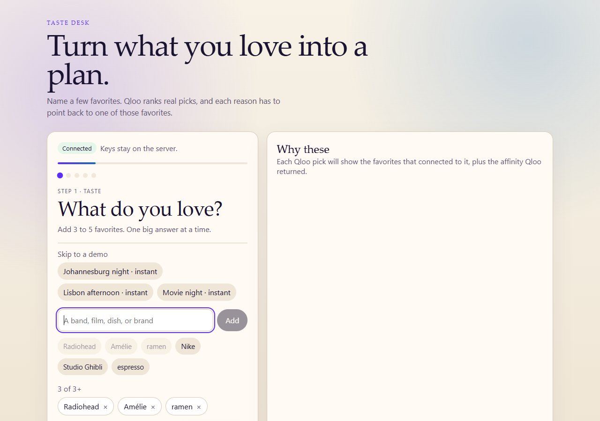
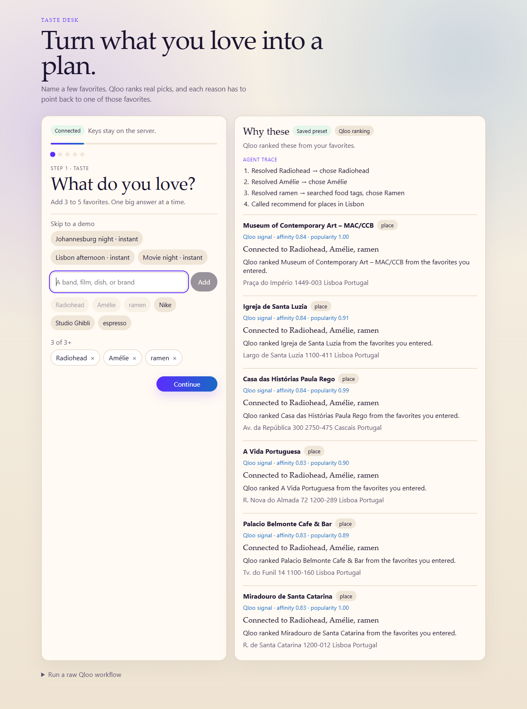
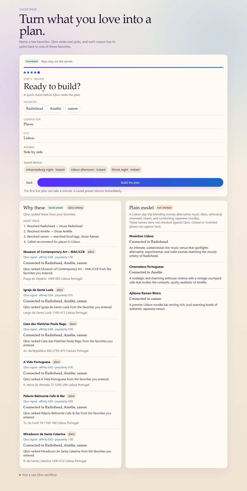

# Taste Desk

Live demo: [https://qloo-taste-desk.onrender.com](https://qloo-taste-desk.onrender.com)







A small hackathon app that turns a few favorites into a Qloo-backed plan. The browser never sees the Qloo or Gemini credentials. An Express server reads them from its environment, runs `qloo exec`, and asks a Gemini Flash model only to explain items Qloo returned. Workflow calls follow the non-interactive contract in `@qloo/qloo-harness` 0.1.26.

## Layout

- `server/` — Express API. Spawns the harness with `shell: false`, caches successful results, and retries only failures the harness marks retryable, at most three times.
- `client/` — Vite + React. The main form calls `/api/plan`. A collapsed panel still calls `/api/exec`.
- `scripts/probe.js` — saves one real `find_tags`, `describe`, and `recommend` response under `docs/samples/`.
- `.env.example` — empty placeholders. Real keys belong in `.env`, which is gitignored.

## Setup

Node.js 22.19 or newer is required by the harness.

```sh
npm install
copy .env.example .env
```

Edit `.env` and set `QLOO_API_KEY` and `GEMINI_API_KEY`. A hackathon key also needs `QLOO_BASE_URL` and `QLOO_TRUSTED_BASE_URL` set to `https://hackathon.api.qloo.com`. Leave `.env` out of git.

```sh
npm test
npm run probe
npm run dev
```

The API listens on `http://127.0.0.1:8787` when you open it from this machine. The page is at `http://localhost:5173` and proxies `/api` to that server. The status pill says Connected when the Qloo key is set.

`POST /api/plan` accepts 3 to 5 favorites, a target (`place`, `movie`, `brand`, `artist`, or `book`), and an optional city. It resolves each favorite with `describe`, calls `recommend`, then asks Gemini for a JSON itinerary. Any item the model names that Qloo did not return is dropped. Place results that look like organizations are dropped when enough visitable venues remain. `/api/exec` and `/api/plan` share a limit of 20 requests per minute per IP. Identical successful Qloo calls stay cached for one hour.

`mode` may be `qloo` (default) or `plain`. Plain asks Gemini with no Qloo catalog, so the page can show both answers for the same favorites. Three saved demos are listed by `GET /api/presets`. When a matching snapshot exists in `server/presets/`, that plan returns immediately and does not spend quota.

## Environment

Set these on the server only. The names are the whole contract; values stay out of git, the client, and the logs.

| Name | Role |
| --- | --- |
| `QLOO_API_KEY` | Server credential for `qloo exec` |
| `GEMINI_API_KEY` | Explains Qloo results with a Gemini Flash model |
| `GROQ_API_KEY` | Server-only fallback if Gemini cannot answer. The page keeps its loading state |
| `QLOO_BASE_URL` | Hackathon gateway, `https://hackathon.api.qloo.com` |
| `QLOO_TRUSTED_BASE_URL` | Must equal `QLOO_BASE_URL` or the harness will not send the key |
| `HOST` | Defaults to `0.0.0.0`, which is what a hosted deploy needs |
| `PORT` | Defaults to `8787`. Render sets this itself |
| `GEMINI_MODEL` | Optional. Defaults to a Gemini Flash model, then the next Flash model |
| `GROQ_MODEL` | Optional. Defaults to `openai/gpt-oss-120b`, then `openai/gpt-oss-20b` |

## Deploy

[render.yaml](render.yaml) is a Render web service on Node `22.19.0`. The build installs workspaces, including `@qloo/qloo-harness`, then builds the client. Start with `npm start`. `HOST` is `0.0.0.0`. The blueprint sets `QLOO_BASE_URL` and `QLOO_TRUSTED_BASE_URL` to the hackathon gateway.

In the Render dashboard, set `QLOO_API_KEY`, `GEMINI_API_KEY`, and `GROQ_API_KEY`. Do not commit them. A missing gateway URL is the usual cause of `QLOO_AUTH` after deploy. The free instance can take 30–60 seconds to wake; the page says so, and the saved presets skip the wait.

```sh
npm run presets
```

Regenerates `server/presets/*.json` from a live plan. The script refuses to write a file that still contains a key.

## What is Qloo-powered

Resolution, recommendations, affinity, and popularity come from Qloo. The model may only explain items in that result set, and the server drops anything else. Each successful plan includes an agent trace: which entity or tag was chosen, that recommend ran, and any non-venues or invented names that were removed. The plain-LLM column is the control: same favorites, no catalog, no guarantee the places exist.

## Limits

Results are aggregate taste affinities, not claims about any individual. The side-by-side model column is unchecked on purpose.

## Architecture

The browser talks only to this API. Express spawns `qloo exec` with `shell: false` and a filtered environment that includes the Qloo key and the gateway URLs. Gemini is called with the key in a header. Successful harness responses are cached in memory for one hour. Rate-limit responses are not retried, so a busy quota is not spent three times.

## Project description

A plain model, given the same favorites, names venues Qloo never returned. Taste Desk turns three to five favorites into a plan in another domain, and it would not work the same without Qloo. Qloo resolves the favorites, recommends real entities, and returns affinity. The page shows that path as an agent trace. A server-side model writes the reason for each pick and must cite the favorites that connected to it. Names the model invents are removed. A side-by-side control shows the unchecked plain answer. Credentials never reach the browser.

## License

[LICENSE](LICENSE) is MIT. GitHub should show that on the repository About section.
